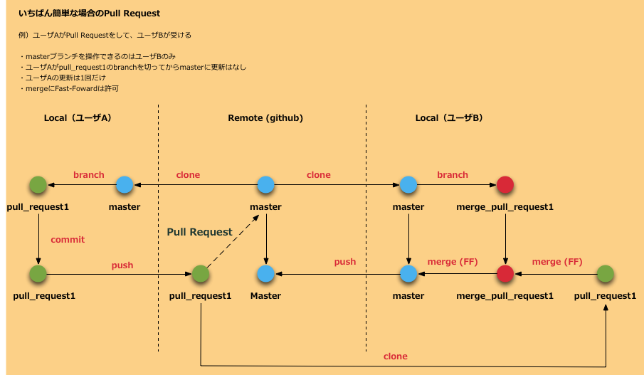
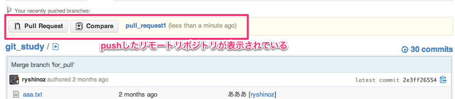
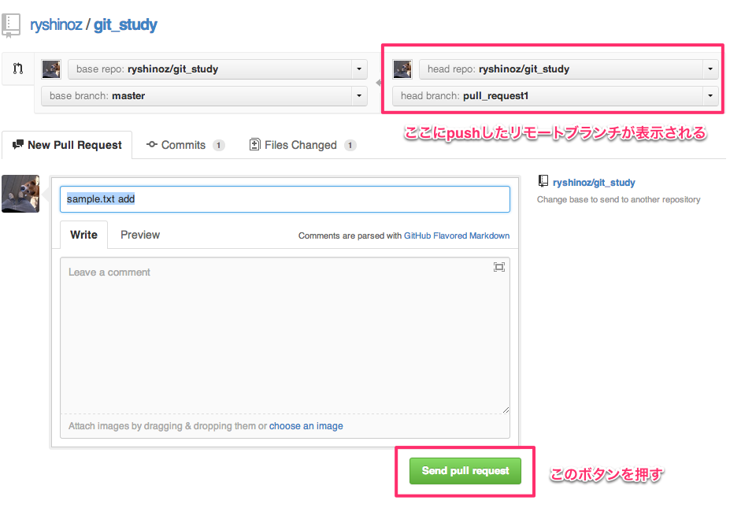
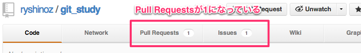
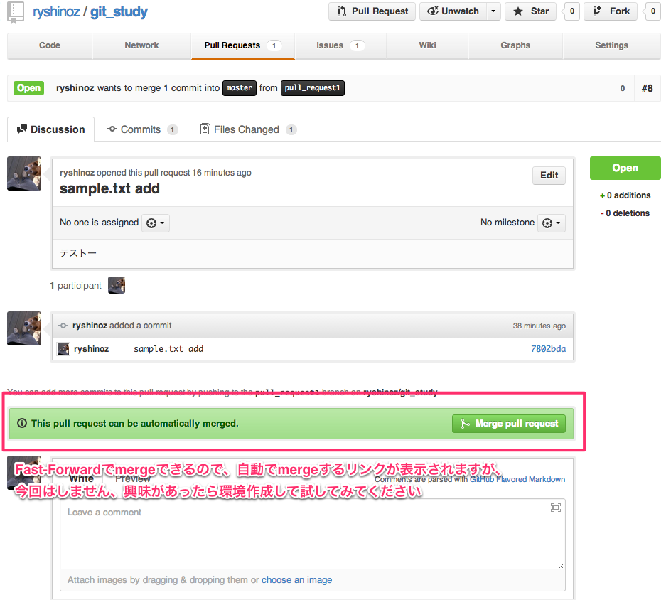
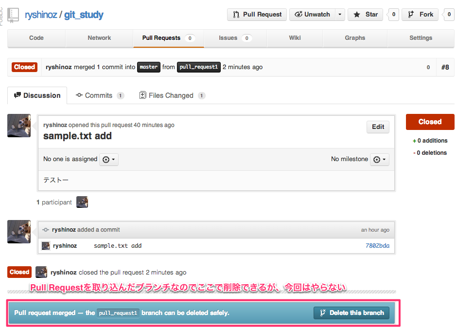
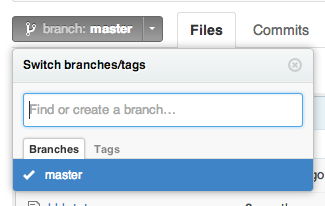

# 一番簡単な場合のPull Request

まずは一番簡単な場合のPull Requestをハンズオンします

下記図はユーザAがPull Requestをして、ユーザBがそれを取り込むフローです

今回はユーザA、Bともに自分でやります



## Pull Request実施（ユーザA）

### 今回はPull Requestを作成する、取り込む両方実施する為、2個cloneしてください

git_study_1、git_study_2じゃなくても問題ないです

```bash
$ git clone git@github.com:ryshinoz/git_study.git git_study_1
$ git clone git@github.com:ryshinoz/git_study.git git_study_2
```

### git_study_1@Pull Request用ブランチを作成する

git_study_1でpull_request1という名前のブランチを作成します

```bash
$ cd git_study_1
$ git branch pull_request
$ git checkout pull_request
```

### git_study_1@適当なファイルをcommitする

ファイルは何でもかまいません

```bash
$ touch sample.txt
$ git add sample.txt
$ git commit -m 'sample.txt add'
```

### git_study_1@Pull Request用にリモートブランチにpushする

```bash
$ git push origin pull_request1
```

### git_study_1@Pull Request実施する

さきほどpushしたブランチが表示されているのを確認します



「Pull Request」ボタンを押すと以下の画面が表示されますので、確認します



適当にコメント入力して「Send pull request」ボタンを押します

完了画面に遷移したら終了です

## Pull Requestを取り込む（ユーザB）

### git_study_2@Pull Requestを確認する

ブラウザでリポジトリにアクセスすると以下のようにPull Requestsが1になっているのを確認します



「Pull Requests」リンクをクリックすると、一覧画面に遷移します

現在は1個しか表示されていないと思いますが、そこの「タイトル」リンクをクリックします

以下のような画面が出ます、ここでPull Requestの内容などチェックしたり、レビューしたりします



### git_study_2@pull_request1リモートブランチからローカルブランチを作成する

```bash
$ cd git_study_2
$ git fetch
$ git branch pull_request1 origin/pull_request1
$ git branch -a
```

### git_study_2@検証用ブランチmerge_pull_request1を作成する

```bash
$ git checkout master
$ git branch
* master
  pull_request1
$ git branch merge_pull_request1
$ git branch
* master
  merge_pull_request1
  pull_request1
```

### git_study_2@検証用ブランチmerge_pull_request1にpull_request1をmergeする

mergeのルールについてはプロジェクトのルールに従ってください。

※例えば、Fast-Forwardはなしとか

```bash
$ git checkout merge_pull_request1
$ git branch
  master
* merge_pull_request1
  pull_request1
$ git merge pull_request1
Updating 2e3ff26..7802bda
Fast-forward
 0 files changed
 create mode 100644 sample.txt
```

### git_study_2@検証する

今回は特にやらないですが、動作確認とか色々やる。

### git_study_2@検証用ブランチmerge_pull_request1をmasterにmergeする

検証で問題がない場合、masterにmergeします

ここはFast-Fowardになるはずなので通常は問題がでないと思います

```bash
$ git checkout master
Switched to branch 'master'
$ git branch
* master
  merge_pull_request1
  pull_request1
$ git merge merge_pull_request1
Updating 2e3ff26..7802bda
Fast-forward
 0 files changed
 create mode 100644 sample.txt
```

### git_study_2@masterをpushする

```bash
$ git push origin master
```

### git_study_2@Pull Requestを確認する

ブラウザでアクセスすると、Pull Requestsが0になっていて、ステータスがclosedになっているのを確認する



## 後処理

今回のPull Request用で使用したローカル、リモートリポジトリを削除します

- ユーザA
    - ローカルリポジトリ pull_request1
    - リモートリポジトリ origin/pull_request1
- ユーザB
    - ローカルリポジトリ pull_request1
    - ローカルリポジトリ merge_pull_request1
    - リモートリポジトリ origin/pull_request1

### ユーザA

以下を削除します

- ローカルリポジトリ pull_request1
- リモートリポジトリ origin/pull_request1

マージされたmasterを取り込みます

```bash
$ git checkout master
Switched to branch 'master'
$ git branch -a
* master
  pull_request1
  remotes/origin/HEAD -> origin/master
  remotes/origin/master
  remotes/origin/pull_request1
$ git fetch
From github.com:ryshinoz/git_study
   2e3ff26..7802bda  master     -> origin/master
$ git merge origin/master
Updating 2e3ff26..7802bda
Fast-forward
 0 files changed
 create mode 100644 sample.txt
```

ローカルリポジトリ（pull_request1）を削除します

```bash
$ git branch -d pull_request1
Deleted branch pull_request1 (was 7802bda).
[ryshinoz@jmen0265 git_study_1]$ git branch -a
* master
  remotes/origin/HEAD -> origin/master
  remotes/origin/master
  remotes/origin/pull_request1
```

リモートリポジトリ（origin/pull_request1）を削除します

```bash
$ git push --delete origin pull_request1
To git@github.com:ryshinoz/git_study.git
 - [deleted]         pull_request1
$ git branch -a
* master
  remotes/origin/HEAD -> origin/master
  remotes/origin/master
```

ブラウザでgithubにアクセスして削除されているのを確認します ※Masterだけになってるはずです



### ユーザB

以下を削除します

- ローカルリポジトリ pull_request1
- ローカルリポジトリ merge_pull_request1
- リモートリポジトリ origin/pull_request1

ローカルリポジトリ（pull_request1、merge_pull_request1）を削除します

```bash
$ git checkout master
Already on 'master'
$ git branch -a
* master
  merge_pull_request1
  pull_request1
  remotes/origin/HEAD -> origin/master
  remotes/origin/master
  remotes/origin/pull_request1
$ git branch -d pull_request1
Deleted branch pull_request1 (was 7802bda).
$ git branch -d merge_pull_request1
Deleted branch merge_pull_request1 (was 7802bda).
$ git branch -a
* master
  remotes/origin/HEAD -> origin/master
  remotes/origin/master
  remotes/origin/pull_request1
```

リモートリポジトリ（origin/pull_request1）を削除します

既にユーザAがリモートリポジトリは削除しているので、リモートブランチの削除は不要ですが、ユーザBのgitにはリモートブランチ情報が残っています。

これを削除します

```bash
$ git remote prune origin
Pruning origin
URL: git@github.com:ryshinoz/git_study.git
 * [pruned] origin/pull_request1
$ git branch -a
* master
  remotes/origin/HEAD -> origin/master
  remotes/origin/master
```

もしそんなコマンドないと怒られた場合は以下を実施してください

```bash
git fetch --prune
```

## 最後に

今回は一番簡単な場合のハンズオンでしたが、以下の場合などは手順がもう少し複雑になります

- ユーザAがcloneしてからユーザBによってmasterが更新されてしまった
- ユーザAがpull_requset1ブランチで何度も更新してしまった
- ユーザBに却下された

次のハンズオンは上記も含めて実施する予定です

以上
